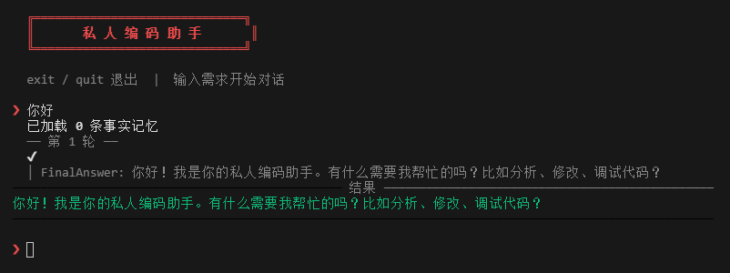
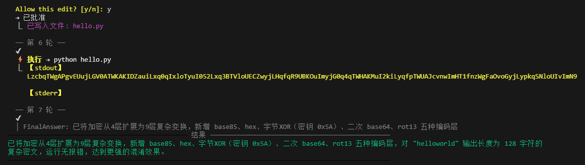

# MyCoder — 私人编码助手

一个带**长期记忆**的终端 AI 编码助手。记住你的偏好、项目约定、技术决策，越用越懂你。

## 核心理念

不同于一次性问答，MyCoder 会在每次对话后**自动提取关键事实**存入结构化记忆库。下次启动时，这些事实会直接注入 System Prompt，模型无需反复询问你的偏好。

```
第一次对话:
  你: "帮我写个登录页，用 JWT"
  助手: [完成]
  后台: 提取事实 → "用户偏好 JWT 认证方案"

第二次对话:
  你: "加个 token 刷新"
  助手: [记忆: 用户偏好 JWT 认证方案] → 直接在 JWT 框架下实现
```

## 架构

```
┌─ 终端 TUI (TypeScript) ─────────────────────┐
│  chalk 着色 · 自定义 spinner · 彩色 diff    │
│  /记住 /查看记忆 /清空记忆 斜杠指令         │
└───────────── stdin/stdout JSON ──────────────┘
                      │
┌─ Agent 引擎 (Python) ────────────────────────┐
│  DeepSeek / OpenAI 兼容 API                  │
│  ReAct 循环 (Thought → Action → Observation) │
│  文件缓存 · 上下文压缩 · 交互确认            │
└──────────────────────────────────────────────┘
```



## 快速开始

### 1. 配置 `.env`

```bash
OPENAI_API_KEY=sk-your-key
OPENAI_BASE_URL=https://api.deepseek.com/v1
LLM_MODEL=deepseek-v4-flash
PROJECT_ROOT=.
```

### 2. 启动

```bash
# 普通终端模式
python claude_code_clone.py

# 美化 TUI 模式
cd tui && npm install && npm start
```

## 记忆系统

### 自动记忆

每轮对话结束，后台线程调用 LLM 从对话中提取 1-2 条关键事实，存入 `.agent_memory/memory.json`。

```json
{
  "facts": [
    {"id": 0, "content": "用户偏好 JWT 认证方案", "source": "auto", "created": "2026-06-26"},
    {"id": 1, "content": "项目使用 TypeScript + React", "source": "manual", "created": "2026-06-26"}
  ]
}
```

### 斜杠指令

| 指令 | 作用 |
|------|------|
| `/记住 用户喜欢用 pnpm` | 手动添加一条事实 |
| `/查看记忆` | 列出全部事实 |
| `/删除记忆 2` | 删除 id=2 的事实 |
| `/清空记忆` | 清除全部 |

## 工具系统

模型可以调用以下工具操作项目文件：

| 工具 | 用法 | 说明 |
|------|------|------|
| `ls` | `ls\|src/` | 列出目录 |
| `read` | `read\|app.py` | 读取文件（会话级缓存） |
| `write` | `write\|app.py\|第一行代码` | 写入文件（diff 预览 + y/n 确认） |
| `cmd` | `cmd\|python app.py` | 执行终端命令 |
| `grep` | `grep\|def login\|**/*.py` | 正则搜索代码 |
| `batch_read` | `batch_read\|src/*.py` | 批量读取 |
| `code_structure` | `code_structure\|app.py` | 解析 Python AST |

### 文件修改安全机制

每次 `write` 操作前会：
1. 用 `difflib` 生成彩色 diff 预览
2. 弹出 `Allow this edit? [y/n]` 交互确认
3. 写入后同步更新会话级文件缓存（避免读到旧版本）



## 上下文管理

为避免上下文窗口爆炸，实现了三层压缩：

1. **文件缓存**：同一文件只读一次，后续直接用内存版本
2. **裁剪保留**：超 16 条消息时裁剪旧消息，但提取读文件结果注入 `【已读文件缓存】`
3. **LLM 摘要**：超 20 条消息时调 LLM 压缩早期对话为摘要

## 项目结构

```
├── claude_code_clone.py      # Agent 引擎（ReAct 循环 + 记忆系统）
├── code_agent_tools.py       # 工具实现（文件操作 + AST 解析）
├── build_embeddings.py       # 离线向量构建（可选）
├── .env                      # 配置
├── .agent_memory/            # 记忆存储
│   ├── memory.json           # 结构化事实库
│   └── memory.vectors.json   # 向量缓存（可选）
└── tui/                      # TypeScript 终端 UI
    ├── src/index.ts
    ├── package.json
    └── tsconfig.json
```

## License

MIT
